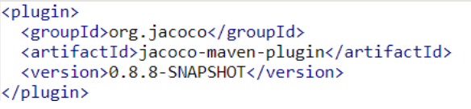

# SonarCloud and JaCoCo
We have used Sonar cloud to analyze the initial project's code quality and monitoring the effect of our refactoring and tests on it.
SonarCloud does not automatically run your tests or compile coverage reports itself. 
It has to import those reports from a coverage analysis that you set up separately.  
For the purpose of our project, we should use the Jacoco library and the associated Jacoco maven.  
## What is Jacoco & why we need it in sonar cloud?
Version 5.12 of our SonarJava analyzer deprecated use JaCoCo’s binary format (.exec files) to import coverage. This binary format is internal to the JaCoCo project, and as such there are no guarantees for backward compatibility, so it should not be used for integration purposes. 

As a replacement, we should use sonar-jacoco plugin, which imports JaCoCo’s XML coverage report, and this is the preferred option now. 

## How should it be integrated to the project?
The JaCoCo Maven plug-in requires 
Maven 3.0 or higher and 
Java 1.5 or higher (for both, the Maven runtime and the test executor). 
The Maven plug-in can be included in your build with the following declaration: 

 

As a result of the modifications on the project, we have achieved an acceptable state in a measure of Code coverage and Technical debt.

The flow of Code coverage improvement also can be seen on this chart.

Overall Result , shows we could obtain 70% coverage of the code , the improvement passed the code quality of the sonar cloud.

